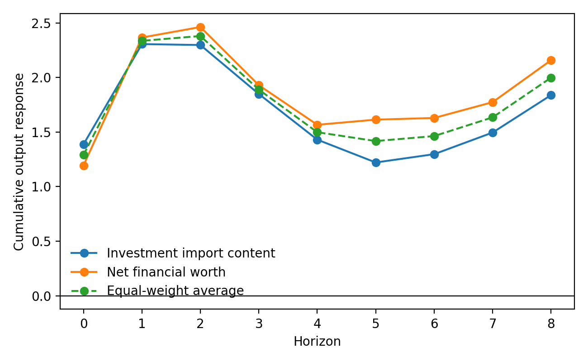
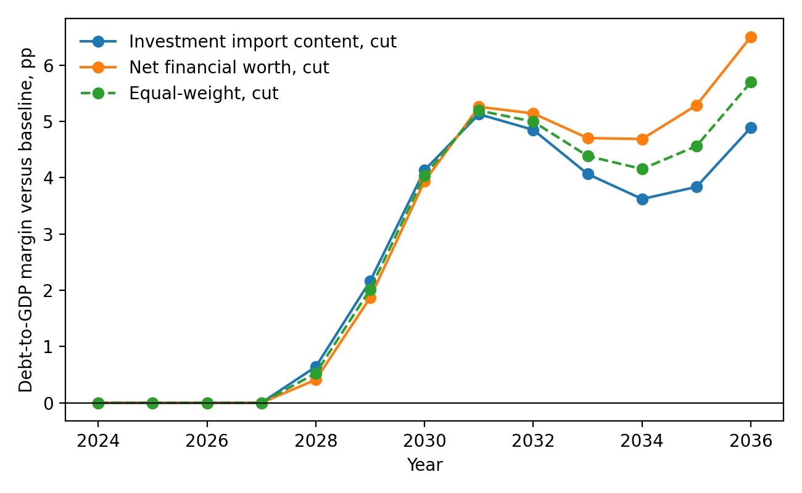

# Abstract

EU fiscal surveillance gives debt projections and expenditure limits institutional force in national budget choices, including choices over public investment. This paper studies how estimated output effects change the debt consequences of Polish public investment policy, considering both an increase in investment and an equal cut. We estimate annual local projections for public-investment shocks in an EU27 panel and evaluate the implied Polish responses using a pre-specified four-state universe: investment import content measured from official OECD TiVA data, public debt, household net financial worth, and real PPP GDP per capita. The first-stage screen retains the investment-import-content and household-net-financial-worth Polish evaluations; real PPP income remains in the candidate universe but is not retained for the downstream Polish paths. The TiVA-based investment import-content state uses the latest official observations through 2022, while the remaining annual panel information is used where available. We then apply the responses to a three-year Polish scenario in which public investment rises by one percentage point of GDP in each year from 2028 to 2030, and to an equal cut over the same years. The horizon-8 cumulative output responses remain positive: 2.11 for the EU27 benchmark, 1.84 for the investment-import-content Polish evaluation, 2.16 for the household-net-financial-worth Polish evaluation, and 2.00 for their equal weight average. By 2036, the expansion lowers the debt-to-GDP ratio relative to baseline, while the equal cuts raise it. For the cut scenario, endpoint margins across the two retained Polish evaluations range from 4.9 to 6.5 percentage points under the institutional debt equation and from 1.7 to 4.3 percentage points under the direct debt-to-GDP local-projection path. The results identify a self-defeating public-investment consolidation mechanism: cuts can improve the primary balance when adopted, yet later raise the debt ratio when persistent output losses dominate the initial accounting gain.

# 1 Introduction
## 1.1 EU fiscal surveillance and debt sustainability analysis

EU fiscal surveillance assesses member states' fiscal plans through legal rules, numerical indicators, medium-term adjustment paths, and model based assessments within the Stability and Growth Pact and the European Semester. It provides the institutional setting in which fiscal effort is measured and national budgetary choices are assessed by the European Commission and the Council (Schmidt, 2015; Van der Veer, 2021; European Commission, 2026). The reformed EU fiscal framework gives debt sustainability analysis a more direct role in prior guidance, medium-term plan assessment, bilateral exchanges with member states, and corrective paths where fiscal risks are judged to be material (European Commission, 2026; Heimberger et al., 2024).

The institutional importance of the Commission framework follows from its role in surveillance. Structural balances, potential output, output gaps, projected debt paths, interest-rate assumptions, growth assumptions, and fiscal multipliers are all model-dependent quantities. Once these quantities enter the surveillance model, a change in the estimated output gap can alter the measured structural balance and the assessed fiscal effort without any contemporaneous change in taxes, expenditure, or the headline budget balance. Heimberger, Huber and Kapeller (2019) illustrate this mechanism in the Commission potential output model: assumptions about production functions, trend labour input, and capacity utilisation feed into output gap estimates, which then affect structural deficit calculations and the fiscal space attributed to a member state. Methodological choices therefore acquire institutional force because they influence how national plans are evaluated.

The Debt Sustainability Monitor 2025 sets out the medium-term projection framework used by the Commission. It combines Commission forecasts with assumptions on potential growth, output gap closure, the structural primary balance, inflation, interest expenditure, ageing-related costs, stock-flow adjustments, deterministic stress scenarios, and stochastic risk analysis (European Commission, 2026). Macroeconomic feedback from fiscal measures enters through GDP, the cyclical budget component, the subsequent primary-balance path, and the interest-growth term through which existing debt is carried forward. In the reformed framework, these projected paths inform prior guidance, assessment of medium-term fiscal-structural plans, Council-endorsed net-expenditure ceilings, annual progress reporting, and the corrective path under the excessive deficit procedure.

That baseline is policy relevant before any public investment scenario is added. In the Debt Sustainability Monitor baseline series used here, Poland's general-government gross debt ratio rises from 55.1 percent of GDP in 2024 to 106.8 percent in 2036, well above the 60 percent Treaty reference value. This is not a benign convergence path: in the same baseline extraction, the endpoint structural balance is close to -10 percent of GDP, while the primary balance is about -3.9 percent of GDP. Poland's domestic debt rules also use a 60 percent threshold, but they refer to the national public-debt concept used in Polish law, not to the EU general-government Maastricht measure used in the Commission projection (Constitution of the Republic of Poland, 1997; Public Finance Act, 2009; European Commission, 2026). Figure 1 reports the Commission baseline debt path used as the official projection benchmark before the scenario is applied; it is not estimated by the local projections and is separate from the public-investment scenarios introduced later.

## 1.2 Debt projections and consolidation evidence

The institutional role of these assumptions makes the underlying evidence base important. The relevant issue is not only whether debt projections are internally consistent, but whether the empirical relationships used to motivate consolidation, debt thresholds, and expenditure cuts are sufficiently robust for the policy role assigned to them.

The importance of assumptions is not confined to the Commission framework. Reinhart and Rogoff (2010) gave a prominent empirical basis for the view that very high public debt is associated with weaker growth. Subsequent replication and threshold analyses showed that this conclusion was highly sensitive to data processing decisions, weighting procedures, sample composition, functional form, and the direction of causality between debt and growth. This debate underscores the caution required when interpreting debt ratios as strict constraints on economic growth (Herndon, Ash and Pollin, 2013; Pescatori, Sandri and Simon, 2014; Panizza and Presbitero, 2013; Egert, 2013; Heimberger, 2021).

A similar caution applies more forcefully to expenditure-based fiscal consolidation. Alesina, Favero and Giavazzi (2015) provide an influential account in which spending-based consolidation plans are less costly than tax-based plans and may operate partly through confidence and private-investment channels. The difficulty is one of construct validity for the question examined here. A multi-year consolidation plan bundles anticipation, credibility, timing, implementation revisions, and expenditure composition into a plan-level treatment. Its tax-versus-spending classification does not isolate public investment, does not identify the public-capital channel, and does not show that investment cuts remain debt reducing once output persistence and the debt denominator are evaluated separately. Carbonari, Farcomeni, Maurici and Trovato (2024) reinforce this point from within the consolidation-plan literature: when mediation channels are modelled, announced spending cuts can have negative indirect output effects. Blanchard and Leigh (2013) show that planned consolidations in Europe were associated with systematic growth forecast errors, consistent with underestimated fiscal multipliers. DeLong and Summers (2012) and Fatas and Summers (2018) show why persistence matters for debt sustainability: when consolidation depresses output long enough to affect productive capacity, a lower primary deficit can coexist with a higher debt ratio. Gechert, Horn and Paetz (2019) further find that European austerity involved larger and more persistent output costs than implied by low-multiplier assumptions. The later multiplier and hysteresis evidence therefore does more than qualify the expenditure-cut result; it blocks its use as a general presumption that public-investment cuts are growth preserving or debt reducing.

For Poland, the institutional consequences are concrete. The medium-term fiscal-structural plan fixes a net-expenditure path, annual progress reports monitor implementation, and the excessive deficit procedure places correction of the deficit inside a Council-recommended adjustment sequence. Fiscal surveillance therefore affects the pace and composition of fiscal adjustment, while Polish macroeconomic assessment also has to consider inflation, external balance, balance-of-payments conditions, domestic fiscal rules, market-rate conditions, and the long-run growth effects of public capital. Grodzicki, Mozdzen and Zygmuntowski (2022) support this broader reading: numerical fiscal aggregates are not self-sufficient policy criteria, and the assessment of fiscal policy should incorporate inflation signals, the current account, and investment expenditure.

Public investment is the fiscal instrument examined in this paper. Expansion in public investment affects current demand, public capital formation, and future productive capacity. Consolidation through public-investment cuts can improve the primary balance mechanically while reducing output and the public capital stock. The literature on budget composition and fiscal-rule design gives a further reason to isolate this instrument. Investment projects are often easier to postpone than transfers, wages, or entitlement programmes, and their economic costs may be less visible when the budget decision is made (Breunig and Busemeyer, 2012; Borge and Hopland, 2015; Pereira and Pinho, 2006; OECD, 2011). Fiscal rule design can also determine whether investment is protected or compressed during adjustment episodes (Ardanaz et al., 2020). The question is therefore how debt projections change when public investment expansion and public investment consolidation are evaluated with estimated growth feedbacks rather than with a single short run multiplier applied to the structural primary balance.

## 1.3 Fiscal multipliers and instrument composition

The Commission's Debt Sustainability Monitor 2025 uses a common fiscal multiplier of 0.6 in the relevant fiscal policy scenarios. A 1 percentage point improvement in the structural primary balance reduces actual GDP growth by 0.6 percentage points in the same year, while potential growth is assumed to remain unchanged (European Commission, 2026). The multiplier affects the debt ratio in two ways: lower GDP raises the debt-to-GDP ratio mechanically by reducing the denominator, and weaker activity changes the cyclical component of the budget balance, which then feeds into the primary-balance path. The Debt Sustainability Monitor framework also relies on a specified output-gap closure rule. The Commission notes that multipliers vary with structural characteristics, cyclical conditions, monetary policy settings, policy instruments, and the composition of adjustment, and it allows member states to justify different values in their own plans. The operational simplification nevertheless remains a common value used for prior guidance across countries.

This instrument-specific question requires more than a common multiplier. Public investment, public consumption, transfers, and taxes have different dynamic effects. Multipliers vary by openness, exchange rate regime, public capital stock, fiscal position, monetary accommodation, and horizon (Ilzetzki, Mendoza and Vegh, 2013; Ramey and Zubairy, 2018; Cloyne, Jorda and Taylor, 2023). Evidence for Poland and for cross-country samples already documents this heterogeneity.

Table 1. Polish multiplier evidence used to motivate instrument specific estimation.

| Source | Fiscal measure | Reported multiplier values |
|---|---|---|
| Ministry of Finance of Poland, Medium Term Fiscal Structural Plan 2025-2028 | NEMPF effective consolidation multiplier and one year category multipliers | Effective consolidation multiplier: 0.449 in 2026, 0.498 in 2027, 0.528 in 2028; one year category multipliers: total expenditure 0.788, public investment 1.493. |
| Haug, Jedrzejowicz and Sznajderska (2019) | Government spending in Poland | Impact 0.70; four quarters 1.13; eight quarters 1.46; peak 1.61 after fourteen quarters. |
| Sznajderska (2025) | Fiscal policy shocks in Poland | Impact spending multiplier 1.25; long run cumulative spending multiplier 1.04; impact tax multiplier -1.18. |
| Haug, Lyziak and Sznajderska (2025) | Local projection IV government spending in Poland | Peak cumulative linear multiplier 1.53 after six quarters; pre-Covid peak 1.38 after eight quarters. |

Table 2. Cross-country and European multiplier evidence used to motivate instrument specific estimation.

| Source | Fiscal measure or conditioning dimension | Reported multiplier values |
|---|---|---|
| Ilzetzki, Mendoza and Vegh (2013) | Government consumption, high income countries | Impact 0.39; long run 0.66. |
| Ilzetzki, Mendoza and Vegh (2013) | Openness and exchange rate regime | Closed economies: impact 0.61, long run 1.10; open economies: impact -0.077, long run -0.46; fixed exchange rates: long run about 1.4; flexible exchange rates: long run about -0.69. |
| Ilzetzki, Mendoza and Vegh (2013) | Pure government investment shocks | High income countries: impact 0.39, long run 1.5; developing countries: impact 0.57, long run 1.6. |
| IMF Working Paper 2019/289 | Public investment and initial public capital stock | Public investment: impact 0.15, two years 0.80; low initial public capital: two years 2.15; high initial public capital: two years 0.15. |
| Ciaffi, Deleidi and Capriati (2024) | Government spending in OECD countries; linear and high public-debt states | Linear model: impact 0.72, five-year 0.87; high-debt cases: impact 0.64 to 0.80, five-year 1.51 to 1.56. |
| Gechert and Will (2012) | Meta-regression by fiscal instrument | Reported means: general public spending 1.0; public investment 1.2; transfers 0.4; taxes 0.6. |
| Saccone (2022) | Public investment in European countries | Total public investment: 0.979 on impact and 2.056 at horizon 6; economic affairs investment: 0.859 on impact and 2.336 at horizon 6. |

The tables show that Polish official planning and the wider multiplier literature already distinguish fiscal instruments and report values that vary by horizon, instrument, and conditioning environment. The negative tax multiplier in Table 1 follows the usual sign convention for a positive tax shock: higher taxes reduce output, so the output response per revenue increase is reported with a negative sign. These sources justify estimating public investment separately and carrying the resulting output path into the debt assessment.

The paper is organised as follows. Section 2 presents the data, fiscal shock construction, and local projection methodology. Section 3 reports the estimated response trajectories. Section 4 embeds these trajectories in public investment expansion and consolidation scenarios for Poland. Section 5 concludes by drawing implications for EU fiscal surveillance and Polish public investment strategy.

# 2 Data and empirical strategy
## 2.1 Local projection framework

Local projections estimate dynamic responses by running a separate regression for each horizon after a policy intervention or shock. The outcome dated \(t+h\) is regressed on the shock dated \(t\), conditional on controls, so the sequence of horizon specific coefficients gives the impulse response. This approach follows Jorda (2005) and the subsequent local projection literature, which emphasises direct estimation of impulse responses without imposing the full dynamic restrictions of a vector autoregression (Jorda and Taylor, 2024). It is well suited to fiscal multiplier analysis because multiplier estimates depend on the shock definition, the fiscal instrument, the horizon, and the conditioning information set (Ramey and Zubairy, 2018; Ramey, 2019).

The public investment shock is defined before the local projection regressions are estimated. The first step estimates a system containing public investment growth, public consumption growth, output growth, and the short-term interest rate. Public investment is ordered first in the recursive timing structure, following the fiscal-shock literature that treats public investment as relatively predetermined within the year because large investment decisions are shaped by multiannual political, administrative, and procurement processes (Ciaffi, Deleidi and Di Domenico, 2024; Ciaffi, Deleidi and Mazzucato, 2024). Under this timing restriction, output, public consumption, and the interest rate may respond within the same year to the public investment movement, while public investment does not respond contemporaneously to those variables. The remaining unexplained movement in public investment growth is then used as the public investment shock in the local projections.

The analysis uses an annual EU27 panel for 2004-2024, beginning with the first year of Poland's EU membership. A Poland-only annual regression would provide too few observations since 2004 to estimate controlled dynamic responses through horizon 8 and too little variation to assess how fiscal transmission changes with country characteristics. The EU27 panel provides variation across countries and time while keeping the estimation within the institutional setting relevant for Poland's fiscal surveillance. Country fixed effects absorb persistent cross-country differences, and year fixed effects absorb common yearly disturbances. The linear EU27 specification estimates a common public investment response conditional on fixed effects and lagged controls. Poland is evaluated later through interactions between the public investment shock and Poland's observed state values.

For each horizon \(h\in\{0,\ldots,8\}\), the baseline linear local projection is

\[
y_{i,t+h}=\alpha_i^h+\tau_t^h+\beta_h s^{GI}_{i,t}
+\gamma_h s^{GC}_{i,t}+\Gamma_h' W_{i,t-1}+u^h_{i,t+h}.
\]

Here \(i\) indexes EU27 member states and \(t\) indexes years. The dependent variable \(y_{i,t+h}\) is the scaled outcome at horizon \(h\), defined as real GDP in output regressions and public investment spending in spending regressions. The term \(s^{GI}_{i,t}\) is the identified public investment shock, and \(s^{GC}_{i,t}\) is the identified public consumption shock included as a fiscal control. The lagged controls are chosen to match the fiscal, output, and monetary variables used in the upstream recursive system, following the practice of conditioning local projections on pre-shock dynamics in the relevant information set (Jorda, 2005; Ciaffi, Deleidi and Di Domenico, 2024). The vector \(W_{i,t-1}\) contains lagged public investment growth, lagged public consumption growth, lagged output growth, and the lagged short term interest rate. The terms \(\alpha_i^h\) and \(\tau_t^h\) denote country and year fixed effects. The coefficient \(\beta_h\) is therefore the common linear EU27 response to the public investment shock at horizon \(h\), conditional on fixed effects, the public consumption shock, and lagged controls.

The linear specification imposes the same marginal response across the panel after these controls. To evaluate how the response changes with country characteristics, the paper also estimates state dependent local projections. The approach follows the interaction logic in Cloyne, Jorda and Taylor (2023), where the effect of a policy intervention can vary with observed information from before the shock year. It is also consistent with the fiscal multiplier literature in which responses vary with macroeconomic conditions and policy settings (Ramey and Zubairy, 2018). In this paper, the state variables are continuous predetermined characteristics rather than binary recession-expansion indicators.

The state dependent specification is

\[
y_{i,t+h}=\alpha_i^h+\tau_t^h+\beta_h s^{GI}_{i,t}
+\theta_h'(s^{GI}_{i,t}\otimes z_{i,t-1})+\delta_h' z_{i,t-1}
+\gamma_h s^{GC}_{i,t}+\Gamma_h' W_{i,t-1}+u^h_{i,t+h}.
\]

The vector \(z_{i,t-1}\) contains lagged state variables. Because these variables are standardised, the coefficient \(\beta_h\) gives the public investment response for a country at the sample mean of the state variables. The vector \(\theta_h\) shows how the response changes when a country's state values differ from that mean. The vector \(\delta_h\) allows the same variables to enter the outcome equation directly, separately from their interaction with the public investment shock. The public consumption shock, lagged controls, and fixed effects are the same as in the linear specification. The evaluation for Poland is obtained by applying Poland's observed standardised state values to the estimated interaction structure. Poland's evaluated response is therefore generated within the state dependent fixed-effects local projection by the mean-state coefficient \(\beta_h\) together with the interaction term \(\theta_h' z_{PL,t-1}\).

The empirical design has two steps. First, the recursive system constructs public investment and public consumption shocks under the timing restriction described above. Second, the identified shocks enter the local projection equations as regressors whose propagation is estimated separately at each horizon. This two-step structure follows Ciaffi, Deleidi and Di Domenico (2024): fiscal shocks are identified first and then introduced into local projections. The present paper adapts that structure to an EU27 annual panel and to Polish state-variable evaluation.

The state variables used in the interaction terms are lagged and standardised on the EU27 panel, as defined in Section 2.2. Appendix A reports the state-variable definitions and the first-stage screen used to admit the Polish evaluations.

Several limitations follow from this design. Local projections are flexible and transparent, but the exogenous variation comes from the recursively identified fiscal shocks and therefore depends on the maintained timing restriction; local projections may also deliver less smooth or less efficient response estimates than a correctly specified dynamic system (Jorda, 2005; Jorda and Taylor, 2024). State dependent local projections require caution when conditioning variables evolve endogenously, when relevant interactions are omitted, or when the evaluated shock lies outside the support of historical experience (Cloyne, Jorda and Taylor, 2023; Goncalves, Herrera, Kilian and Pesavento, 2023). The estimates should therefore be read as conditional dynamic responses to identified fiscal shocks within the observed EU27 panel.

## 2.2 State variables

This section defines the country characteristics used to condition fiscal shock propagation in the EU27 panel. The four structural states are investment import content, public debt, household net financial worth, and real PPP income level. Investment import content captures the import leakage mechanism in the demand category examined here, because the policy object is public investment rather than aggregate demand in general. Public debt captures macro-financial and institutional fiscal position channels. Household net financial worth captures the household financial-accounts balance-sheet position. Real PPP income level summarises development differences in institutions, market structure, relative prices, and macroeconomic environment (Ilzetzki, Mendoza and Vegh, 2013; Huidrom, Kose, Lim and Ohnsorge, 2019; Kaplan, Violante and Weidner, 2014; Cloyne, Jorda and Taylor, 2023).

In the regressions, a state variable is a predetermined country characteristic that interacts with the fiscal shock and summarizes the environment in which fiscal transmission occurs. It is measured before the shock year and is not part of the subsequent response path. This distinction follows Cloyne, Jorda and Taylor's (2023) separation between treatment, conditioning state, and dynamic propagation. It also aligns with fiscal position research that treats initial fiscal conditions as possible determinants of multiplier strength rather than as the fiscal outcome to be explained (Huidrom, Kose, Lim and Ohnsorge, 2019). The import-content source is official OECD TiVA 2025 and is available for the GFCF measure through 2022. The Polish evaluation therefore uses the latest common official TiVA investment profile while retaining the local-projection logic and debt application described below.

The operational definitions are placed on a standardised scale before Section 2.3 evaluates subsets of the candidate universe. The table reports each variable's measurement, standardisation moments, observation count, and Poland's value before and after standardisation. The TiVA-linked common window is 2004-2022. The public-debt state uses the Eurostat debt observations available in the annual debt panel.

| State variable | Definition | EU27 mean | EU27 sd | n | Poland value | Poland standardised value |
|---|---|---:|---:|---:|---:|---:|
| Investment import content | Import content of gross fixed capital formation, measured from OECD TiVA domestic value-added shares | 0.429 | 0.101 | 513 | 0.413 | -0.161 |
| Public debt | Maastricht gross debt, percent of GDP | 62.5 | 36.5 | 567 | 48.8 | -0.377 |
| Household net financial worth | Negative household net financial worth divided by nominal GDP | -1.112 | 0.592 | 513 | -0.657 | 0.769 |
| Real PPP income level | Log real GDP per capita in 2020 PPS terms | 10.210 | 0.384 | 513 | 10.184 | -0.068 |

Investment import content is included because the domestic output effect of investment demand depends on how much of the expenditure is met by domestic value added rather than imported content. Broad openness is a conventional fiscal-multiplier state, but it is an economy-wide proxy. The analysis therefore constructs an investment import-content state from the official OECD TiVA indicator for the domestic value-added share of gross fixed capital formation. The paper does not present this as a ready-made official category; it is a descriptive transformation of an official TiVA indicator for the state-dependent specification.

Public debt is included as a fiscal position state. In the multiplier literature, the initial fiscal position can condition transmission through sovereign risk premia, economy wide borrowing costs, exchange rate dynamics, and fiscal rule constraints. Ilzetzki, Mendoza and Vegh (2013) treat public indebtedness as a country characteristic relevant for fiscal multiplier heterogeneity, while Huidrom, Kose, Lim and Ohnsorge (2019) connect fiscal positions to interest rate and risk premium channels. Debt therefore appears in two distinct roles. In Section 2, the public debt ratio is a pre-shock fiscal position characteristic that conditions the estimated output response. In Section 4, the future debt-to-GDP path is the outcome generated by the scenario analysis.

In the Polish setting, the interpretation of debt requires further qualification. Poland's monetary sovereignty means that public debt should not be read as evidence of a mechanical inability to finance spending, nor as a hard financing constraint comparable to that faced by a country without its own currency (Blanchard, 2019; Grodzicki, Mozdzen and Zygmuntowski, 2022). Debt can nevertheless matter as a macro-financial and institutional conditioning variable. The EU projection and the state variable used here are based on Maastricht general-government gross debt. Polish constitutional and Public Finance Act thresholds refer instead to national public debt. The two concepts are related fiscal-rule objects, but they are not the same statistical measure. Polish fiscal documents treat debt projections as operating through EU fiscal rule compliance, domestic debt rules, interest expenditure assumptions, market rate expectations, inflation, and exchange rate conditions. The broader debt literature links fiscal position to risk premia and interest-growth dynamics (Ministry of Finance of Poland, 2024; European Commission, 2026; Huidrom, Kose, Lim and Ohnsorge, 2019; Blanchard, 2019). These channels justify including debt in the state space while avoiding a debt-threshold interpretation of Polish fiscal capacity.

Household net financial worth is included as a financial-accounts measure of the household sector's net financial position. It measures financial assets net of liabilities relative to GDP, so it focuses on the financial side of household balance sheets and excludes non-financial assets such as housing from the numerator. The transformation is signed so that higher values correspond to weaker household net financial worth relative to GDP. The economic role is a household financial-resilience state: fiscal shocks can transmit differently when household balance sheets leave less net financial room to smooth consumption. This is the comparable EU27 macro-panel version of a mechanism developed in the literature on household balance sheets, liquid resources, leverage, and hand-to-mouth consumption responses (Kaplan, Violante and Weidner, 2014; Bernardini, De Schryder and Peersman, 2017; Krajewski and Pilat, 2025).

Real PPP income level is included because fiscal transmission may vary across economies with different income levels, institutional depth, market structures, relative prices, and macroeconomic environments. Ilzetzki, Mendoza and Vegh (2013) explicitly study multiplier heterogeneity across high-income and developing economies, and Huidrom, Kose, Lim and Ohnsorge (2019) likewise connect multiplier variation to structural and macro-financial conditions. The analysis measures development with real GDP per capita in purchasing-power-standard terms, so that cross-country income comparisons are less driven by price-level differences than in a current-price national-account measure.

The universe is limited to these four variables because multidimensional state dependence raises both conceptual and empirical discipline problems. Cloyne, Jorda and Taylor (2023) show that focusing on a single state dimension can conceal heterogeneity generated by interactions among state variables, but their framework also implies that the state space must remain interpretable and clearly separated from results-based model selection. Ilzetzki, Mendoza and Vegh (2013) similarly motivate heterogeneity through country characteristics rather than through an unrestricted search across all possible conditioning variables. The resulting candidate universe keeps the analysis focused on investment import content, public debt, household net financial worth, and real PPP income level, whose economic meanings are clear before the first-stage empirical evaluation.

Unemployment and the output gap belong to the business-cycle state dependence literature rather than to the structural universe used here. Auerbach and Gorodnichenko (2012, 2013) and Ramey and Zubairy (2018) examine whether fiscal multipliers differ across slack and expansion states, and those contributions motivate a distinct cyclical approach to state dependent fiscal transmission. The design used here targets slower-moving structural heterogeneity across EU27 economies. This restriction also limits an endogeneity concern emphasized in the state dependent local projection literature: unemployment and the output gap are contemporaneous summaries of the business cycle and may move jointly with fiscal shocks and output responses (Cloyne, Jorda and Taylor, 2023). The empirical question is therefore narrowed to structural conditioning variables, while recession-expansion asymmetries remain a distinct design.

Section 2.2 therefore establishes the candidate universe of state variables. The analysis then evaluates non-empty combinations of the four variables under criteria fixed before the response analysis. The four-variable set remains fixed, preserving the distinction between structural state definition, subset selection, and multiplier interpretation emphasized by Cloyne, Jorda and Taylor (2023).

## 2.3 First-stage specification criteria

Section 2.2 limited the conditioning universe to four state variables: investment import content, public debt, household net financial worth, and real PPP income level. These four variables imply fifteen non-empty candidate subsets. The subsets are evaluated before the response analysis reported in Section 3. The first-stage procedure uses only this specified universe to determine which combinations are empirically suitable for the Polish evaluation.

The procedure is motivated by a tension in state dependent local projections. Omitting relevant state dimensions can confound the interpretation of interaction terms, while adding interactions can leave the panel with weak support, unstable estimates, or excessive dependence on a small number of country observations (Cloyne, Jorda and Taylor, 2023). The criteria therefore discipline subset admission without favouring the largest specification by default.

The criteria combine numerical, support, relevance, and stability checks. A candidate specification must have a full-rank regressor set, acceptable condition numbers, and tolerable collinearity among included state variables. Poland's evaluated state values must also lie within empirical support, as measured by standardised values and proximity to the observed country distribution. The interaction between the public investment shock and the included state variables must demonstrate statistical relevance for output at the terminal horizon designated for the first-stage assessment. Finally, the candidate must remain estimable under leave-one-country-out deletions, bootstrap resampling, and partitioned time-block checks. These nine criteria apply uniformly to all fifteen candidate subsets within the same first-stage evaluation framework.

The numerical diagnostics address situations in which state dependent specifications are technically estimable yet practically unstable. Rank deficiency implies the regression coefficients of interest are not uniquely identified in the diagnostic horizon. Elevated condition numbers or substantial collinearity among state variables indicate that minor perturbations in data could substantially alter interaction estimates. These diagnostics align with established regression diagnostic principles that emphasise sensitivity to leverage, ill-conditioning, and influential data subsets (Welsch and Kuh, 1977).

Support diagnostics address a distinct challenge: the Polish evaluation is meaningful only if Poland's state values lie within the empirical domain represented by the EU27 panel. Accordingly, the criteria verify whether Poland's standardised state values are bounded and close to the observed distribution of country observations. The principle is that conditional inference becomes fragile when the target lies in a poorly represented part of the covariate distribution (Crump, Hotz, Imbens and Mitnik, 2009; Li, Morgan and Zaslavsky, 2018). Here, the support checks safeguard against extrapolating Polish-evaluated responses from state combinations not sufficiently represented in the panel.

The output-interaction diagnostic asks whether the interaction terms between the public investment shock and the included state variables are jointly relevant in the output equation. The test is implemented at horizon \(h=8\), the terminal horizon used for the reported output-response paths and the later debt application. A candidate specification is retained when the Wald test rejects joint irrelevance at the conventional \(p < 0.05\) threshold.

Stability checks account for the panel structure underlying the design. Clustered panel inference must address within-country correlation, since residuals for the same country may be correlated over time even when residuals are treated as independent across countries (Cameron and Miller, 2015). With a limited number of heterogeneous country clusters, a candidate specification may be driven by particular countries or by a narrow time segment, even when the full-sample regression is estimable (MacKinnon, Nielsen and Webb, 2023). The leave-one-country-out, bootstrap, and time-block checks therefore ask whether the specification can be re-estimated with well-defined coefficients after plausible changes to the country or time composition of the panel. These checks identify specifications whose numerical properties are sufficiently stable for the Polish evaluation before the standard errors for the reported response paths are interpreted.

Two specifications satisfy all nine criteria. The table reports the retained state variables, the output-interaction p-value used in the first-stage procedure, the support diagnostic, Poland's maximum absolute standardised state value inside the retained subset, and the stability checks.

| Retained specification | State variables included | Output-interaction p, \(h=8\) | Support p-value | Maximum absolute Polish z-score | Stability checks |
|---|---|---:|---:|---:|---|
| Investment import-content specification | Investment import content | 0.004 | 0.872 | 0.161 | 27/27 country deletions; 19/19 resamples; 3/3 time blocks |
| Household net-financial-worth specification | Household net financial worth | 0.013 | 0.441 | 0.769 | 27/27 country deletions; 19/19 resamples; 3/3 time blocks |

Appendix A reports the state-variable definitions and a compact summary of the first-stage screen. Real PPP income level belongs to the conditioning universe, but income-level interactions are not carried forward because no candidate including that state satisfies the output-interaction criterion once the full screen is applied. The single-variable real PPP income specification has p=0.463, and larger income-level combinations also remain outside the retained set. The combined investment import-content, public-debt, and household net-financial-worth specification has p=0.957 and is likewise not retained. Section 3 therefore reports empirical response paths for the linear EU27 benchmark specification and the two state dependent specifications retained here.

# 3 Results

## 3.1 EU27 panel benchmark and Polish evaluations within the EU27 panel

The results first report cumulative output responses for public investment, because the debt application in Section 4 uses the estimated output paths as inputs.

For each horizon \(h\), \(K_Y(h)\) denotes the cumulative real GDP response through horizon \(h\) to the identified public-investment shock. The corresponding \(K_G(h)\) is the cumulative movement in public-investment spending generated by the same shock. The distinction matters because the scenario in Section 4 is stated in policy-accounting units, as annual actions of one percentage point of GDP, while the empirical model estimates the dynamic spending movement produced by an identified shock. The fiscal-multiplier literature normally treats a cumulative multiplier as cumulative output movement relative to cumulative government-spending movement, not only relative to the first-period budget entry (Ilzetzki, Mendoza and Vegh, 2013; Ramey and Zubairy, 2018; Ciaffi, Deleidi and Di Domenico, 2024). In the debt application, \(K_G(h)\) therefore maps the estimated shock scale to the stated fiscal action, while \(K_Y(h)\) carries the output feedback. Table 3 reports \(K_Y(h)\) through the eighth annual horizon for the EU27 panel benchmark, the two Polish evaluations retained by the first-stage procedure, and their equal weight arithmetic average.

Table 3. Horizon 8 cumulative output responses for public investment.

| Estimation track | Country characteristics used for evaluation | Cumulative output response at horizon 8 | Spending response at horizon 8 | Interpretive role |
|---|---|---:|---:|---|
| EU27 panel benchmark | Country fixed effects and year fixed effects; no state interactions | 2.11 | n/a | Average EU27 public investment response |
| Polish evaluation based on investment import content | Poland's official TiVA investment import-content profile | 1.84 | 0.69 | Retained import-leakage evaluation |
| Polish evaluation based on household net financial worth | Poland's financial-accounts balance-sheet profile | 2.16 | 0.75 | Retained household-balance-sheet evaluation |
| Equal weight average across the two Polish evaluations | Arithmetic average of the two retained Polish paths | 2.00 | 0.72 | Summary path used later |

The EU27 panel benchmark gives a cumulative output response of 2.11 at horizon 8. This estimate is the response for the panel average conditional on country and year fixed effects and the lagged controls in the linear specification. Because the linear specification imposes a common slope on the public investment shock, the estimate serves as the EU27 benchmark rather than as a Poland specific response.

The investment import-content Polish evaluation gives a cumulative output response of 1.84 at horizon 8. Poland's evaluated import-content value is close to the EU27 mean in standardised terms. The interpretation is tied to import leakage: the domestic output response to investment depends on the share of investment demand satisfied by domestic value added rather than by imports (Ilzetzki, Mendoza and Vegh, 2013; Cacciatore and Traum, 2020).

The household net-financial-worth Polish evaluation gives a cumulative output response of 2.16 at horizon 8. In this specification, Poland is evaluated through the household sector's net financial balance-sheet position rather than through a direct credit-flow measure. The state therefore captures a financial-accounts balance-sheet channel: the transmission of fiscal shocks can differ when household financial assets net of liabilities are weaker relative to GDP (Kaplan, Violante and Weidner, 2014; Bernardini, De Schryder and Peersman, 2017).

The equal weight average across the two Polish evaluations retained by the first-stage procedure is 2.00 at horizon 8. It is a straightforward arithmetic summary of the two Polish-evaluated paths, not a new estimator and not a formal model-selection result.

The subsection therefore reports the EU27 panel benchmark, the two Polish evaluations retained by the first-stage procedure, and their equal weight average. The EU27 benchmark yields a cumulative output response of 2.11 at horizon 8. The Polish-evaluated estimates range from 1.84 to 2.16, depending on whether Poland is evaluated through investment import content or household net financial worth. The equal weight average is 2.00, close to the EU27 benchmark but derived from two distinct Polish-evaluated paths. Section 3.2 examines these response paths across horizons and assesses their persistence before Section 4 applies the results to public investment consolidation and expansion scenarios.

## 3.2 Persistence and shape of the output responses across horizons

Section 3.1 reported horizon 8 cumulative output responses for the EU27 panel benchmark, the two Polish evaluations retained by the first-stage procedure, and their equal weight average. The horizon 8 values are endpoints of a sequence of cumulative response paths. This subsection follows \(K_Y(h)\), the cumulative output response at horizon \(h\), from impact through horizon 8.

Figure 2 plots the full sequence. The figure reports the estimated dynamic output response in cumulative form: at each horizon, \(K_Y(h)\) is the cumulative real GDP response under the paper's public-investment shock normalization. The figure therefore reports the cumulative output-response path rather than the unscaled horizon-specific impulse response.

The estimated paths remain positive throughout the reported horizon. They rise strongly in the first two years, moderate in the middle horizons, and then rise again by horizon 8. The sign is important for the scenario application: for an equal public-investment cut, the same response paths imply a persistent output loss rather than a transitory impact effect. The investment import-content Polish evaluation reaches 1.84 at horizon 8. The household net-financial-worth evaluation reaches 2.16. Their equal weight average is close to the EU27 benchmark at the final horizon, while still preserving the distinction between the import-leakage and household-balance-sheet evaluations.

Table 4 reports selected horizons from the same paths, and Appendix B reports the full values at each horizon.

Table 4. Selected horizons of cumulative output-response paths \(K_Y(h)\).

| Empirical path | \(h=0\) | \(h=2\) | \(h=5\) | \(h=8\) |
|---|---:|---:|---:|---:|
| EU27 panel benchmark | 1.14 | 2.20 | 1.71 | 2.11 |
| Polish evaluation based on investment import content | 1.39 | 2.30 | 1.22 | 1.84 |
| Polish evaluation based on household net financial worth | 1.19 | 2.46 | 1.61 | 2.16 |
| Equal weight average across the two Polish evaluated paths | 1.29 | 2.38 | 1.42 | 2.00 |

The selected horizons show that the EU27 benchmark and the equal weight Polish average remain close at horizon 8, while the two Polish evaluations differ modestly at the final horizon. At horizon 8, the investment import-content response is 1.84 and the household net-financial-worth response is 2.16. The average therefore summarizes the two retained Polish evaluations but does not remove the difference between the import-leakage and household-balance-sheet channels.

The main implication is persistence over the observed local projection horizon. The estimated response extends beyond the impact period: cumulative output responses remain positive through horizon 8, and the later values are still economically material. For an expansion, persistence raises output over the medium-term horizon; for an equal cut, it carries the output loss into the years in which the debt ratio is assessed. In the language of fiscal hysteresis, this matters because demand shocks can interact with capital accumulation, labour market attachment, and future productive capacity (DeLong and Summers, 2012; Fatas and Summers, 2018; Engler and Tervala, 2016; Gechert, Horn and Paetz, 2019).

# 4 Application to Polish public investment scenarios

## 4.1 Scenario design

Polish public investment lies at the intersection of development planning, EU fiscal surveillance, and political discretion over implementation. Poland's medium-term fiscal-structural plan is organised around a net expenditure path to 2028. Official Polish documents state that Poland has been under the excessive deficit procedure since July 2024. Assessment under the procedure focuses on compliance with the recommended expenditure path and on progress reporting for reforms and investments linked to EU priorities (Ministry of Finance of Poland, 2024, 2025; European Commission, 2026). The institutional issue concerns both the aggregate size of the fiscal balance and the composition of adjustment when multiannual investment commitments must be carried through successive budgets under a surveillance framework that evaluates expenditure growth and debt projections.

Centralny Port Komunikacyjny illustrates this margin because the project was not cancelled, but the programme in force for 2024-2032 redefined its financing profile, implementation horizon, and rail composition. The updated programme sets out airport, high-speed rail, and road commitments with an official envelope of PLN 131.7 billion and schedules the first stage of the airport and the Warsaw-CPK-Lodz high-speed connection by the end of 2032. Relative to the 2024-2030 programme adopted in 2023, the update reduces the headline envelope from PLN 155.1 billion, lowers the State Treasury engagement limit from PLN 66.2 billion to PLN 62.9 billion, extends the horizon by two years, and reduces the maximum annual State Treasury bond engagement from more than PLN 13 billion to about PLN 11.5 billion. The rail component was also reallocated: official and public sources report higher financing for the high-speed "Y" line, lower financing for subregional rail investment, and movement of connections such as Plock-Warsaw-Grudziadz-Gdansk beyond 2032. Public mobilisation around the project, including the citizens' bill supported by nearly 200,000 signatures, indicates the political cost of outright cancellation. The case is therefore best read as formal continuation under politically mediated delay, financial reprofiling, and partial resequencing rather than as simple abandonment (Council of Ministers of Poland, 2023, 2024; Centralny Port Komunikacyjny, 2025; TVN24/PAP, 2024; TakDlaCPK, 2025; Interia, 2024).

The Polish Nuclear Power Programme shows a comparable pattern of continuity combined with delay and staged reconfiguration. The 2025 programme update keeps the strategic target of two nuclear power plants with total installed capacity of about 6 to 9 GWe, but it moves the first plant onto a later schedule: the 2020 programme placed the first unit into operation in 2033, whereas the 2025 update plans commercial operation of the first reactor in 2036, followed by further units in 2037 and 2038. Resolution No. 66 of 24 June 2024 had already replaced Appendix 3 to the programme, which concerns implementation expenditure. The 2025 update also places the second plant in a decision-dependent preparatory phase, with location screening, technology and contractor selection, business-model design, financing arrangements, and ownership structure to be settled through staged work. Siting is focused on coal-region candidates: Belchatow, Konin, Kozienice, and Polaniec are identified for more detailed analysis, with Belchatow and Konin preferred. Later official material describes PGE's full control over the second-project vehicle and continuing analysis of Konin, Belchatow, and Turow. The earlier PGE-ZE PAK-KHNP route at Patnow therefore ceased to function as the operative delivery route after KHNP's withdrawal and PGE's acquisition of full control over PGE PAK Energia Jadrowa. Nuclear investment remains strategically embedded, but this change represents a politically mediated retreat from that earlier route and a move toward slower, state-controlled preparation while the programme objective remains formally in place (Polish Nuclear Power Programme, 2020; Council of Ministers of Poland, 2024; Ministry of Industry of Poland, 2025; Ministry of State Assets of Poland, 2022; Yonhap, 2025; Pulse, 2025; Notes from Poland, 2025; Ministry of Energy of Poland, 2025).

The scenario represents this implementation margin as a repeated annual public-investment decision. It uses three public investment actions, each equal to 1 percentage point of GDP, in 2028, 2029, and 2030. With a positive sign, public investment is increased by 1 percentage point of GDP in each of those three years. With a negative sign, public investment is reduced by the same amount in each year. The scale is a tractable programme-level margin for multiannual investment policy rather than a literal allocation to one project. The one-percentage-point action is the policy scale; it is not assumed to be the full dynamic spending path generated by the estimated shock. As described in Section 3.1, the empirical translation uses \(K_G\) to link the identified public-investment shock to that policy scale and \(K_Y\) to carry the corresponding output response. After 2030, no further public investment action is added; the analysis follows the fiscal and output effects of the three actions already introduced.

The three-year path corresponds to the way large transport and energy programmes are implemented. Annual appropriations, procurement decisions, design and permitting stages, construction schedules, co-financing arrangements, and administrative decisions determine whether previously announced commitments expand, narrow, or move across years. A sequence of three actions therefore represents repeated investment decisions inside the medium-term expenditure horizon while allowing the same design to be read in both directions: as development expansion and as consolidation through public investment cuts.

The expansion and cut cases are opposite signs of the same public investment path. Reversing the sign reverses the discretionary primary-balance impulse and the estimated output response while holding timing, scale, horizon, and debt accounting fixed. This symmetry is substantively important because the paper studies public investment on both sides of the fiscal decision: development expansion and consolidation through the same investment channel.

The first debt calculation follows the medium-term debt equation used in the Debt Sustainability Monitor. In that framework, the debt-to-GDP ratio is carried forward by the interest-growth term, the primary balance, and stock-flow adjustments (European Commission, 2026). In the application, the public investment action changes the discretionary primary-balance path, and the estimated output response changes the GDP feedback entering the debt ratio. This calculation keeps the baseline projection path as the accounting environment while replacing the relevant growth feedback with the estimated public investment response.

The second debt calculation is the direct debt-to-GDP local-projection path. It estimates the debt-to-GDP response to the same public investment shock directly and applies that response to the same three annual actions outside the full medium-term debt equation. A cut raises the primary balance at the outset, but the associated output loss and debt-ratio response can still leave the debt ratio higher by the endpoint. An expansion lowers the primary balance at the outset, but the associated output gain and debt-ratio response can leave the debt ratio lower by the endpoint. This calculation follows debt and multiplier studies that evaluate fiscal policy through its effect on the debt-to-GDP ratio. It also matches work linking government investment shocks directly to debt outcomes (DeLong and Summers, 2012; Fatas and Summers, 2018; Ciaffi, Deleidi and Di Domenico, 2024).

## 4.2 2036 debt-to-GDP impact across specifications

This subsection reports the 2036 debt-to-GDP margins for the public investment scenario defined in Section 4.1. Each table entry is a percentage point difference from the baseline debt-to-GDP ratio in 2036. Positive values mean that the debt-to-GDP ratio is higher than baseline; negative values mean that it is lower than baseline.

Table 5 reports the endpoint margins.

Table 5. 2036 debt-to-GDP margins relative to baseline.

| Empirical path | Expansion, institutional debt equation | Expansion, direct debt-to-GDP local-projection path | Cut, institutional debt equation | Cut, direct debt-to-GDP local-projection path |
|---|---:|---:|---:|---:|
| EU27 panel benchmark | -6.5 | -3.7 | 7.0 | 3.7 |
| Polish evaluation based on investment import content | -4.6 | -1.7 | 4.9 | 1.7 |
| Polish evaluation based on household net financial worth | -6.1 | -4.3 | 6.5 | 4.3 |
| Equal weight average across the two Polish evaluations | -5.4 | -3.0 | 5.7 | 3.0 |

Figure 3 summarises the cut-scenario margins under the institutional debt equation. The baseline rises over 2028-2036, so the substantive question is whether each public investment scenario leaves the debt ratio below or above that baseline. The expansion scenarios end below baseline in 2036, while the cut scenarios end above it. The common endpoint pattern reflects how output persistence enters the debt calculation. Public investment expansion pulls the debt ratio below baseline when higher output persists, while a symmetric cut can raise the ratio once the output loss is carried through the debt-to-GDP calculation.

The EU27 panel benchmark provides the comparison point for the application. A three-year public investment expansion lowers the 2036 debt-to-GDP ratio by 6.5 percentage points under the institutional debt equation and by 3.7 percentage points under the direct debt-to-GDP local-projection path, reported at the 2036 endpoint, eight years after the first action and six years after the final action. The corresponding public investment cut raises the ratio by 7.0 percentage points and 3.7 percentage points. In the average EU27 response, the expansion is debt-reducing relative to baseline by 2036, while the symmetric cut is debt-increasing.

The Polish evaluation based on investment import content gives a smaller debt response than the EU27 benchmark, but it does not reverse the sign. The public investment expansion lowers the 2036 debt-to-GDP ratio by 4.6 percentage points under the institutional debt equation and by 1.7 percentage points under the direct debt-to-GDP local-projection path. The public investment cut raises it by 4.9 percentage points and 1.7 percentage points. In this specification, the output loss remains large enough for the debt-to-GDP ratio to rise by 2036 despite the initial improvement in the primary balance.

The Polish evaluation based on household net financial worth gives the largest retained Polish margin. Under the institutional debt equation, the expansion lowers the 2036 debt-to-GDP ratio by 6.1 percentage points, while the cut raises it by 6.5 percentage points. Under the direct debt-to-GDP local-projection path, the same expansion lowers the ratio by 4.3 percentage points, and the same cut raises it by 4.3 percentage points. The household balance-sheet evaluation therefore keeps the self-defeating sign under both debt calculations.

The equal weight average across the two Polish evaluations points in the same direction as the specification-level results. The public investment expansion lowers the 2036 debt-to-GDP ratio by 5.4 percentage points under the institutional debt equation and by 3.0 percentage points under the direct debt-to-GDP local-projection path. The public investment cut raises the ratio by 5.7 percentage points and 3.0 percentage points. The average therefore does not turn public investment cuts into a debt-improving consolidation by 2036.

Across all reported specifications, public investment cuts leave the 2036 debt-to-GDP ratio above baseline. The magnitude differs across specifications and debt calculations, from 1.7 percentage points in the investment import-content direct path to 7.0 percentage points in the EU27 institutional debt equation, but the sign of the cut result does not. The expansion side of the same scenario is also informative: across the EU27 benchmark, both Polish evaluations, and their equal weight average, public investment expansion leaves the 2036 debt-to-GDP ratio below baseline under both debt calculations. The result is consistent with the self-defeating consolidation literature: when output effects persist, the GDP channel can overturn the apparent fiscal gain from public investment cuts (DeLong and Summers, 2012; Fatas and Summers, 2018).

# 5 Conclusion

This paper examined public investment as both a development instrument and an object of fiscal surveillance. Annual EU27 local projections estimate public investment responses and evaluate Poland through structural characteristics observed before the shock year. The first-stage screen admits two Polish evaluations: one based on investment import content and one based on household net financial worth. The horizon-8 cumulative output responses remain positive under the paper's public-investment shock normalization: the EU27 benchmark is 2.11, the investment import-content Polish evaluation is 1.84, the household net-financial-worth Polish evaluation is 2.16, and the equal weight Polish average is 2.00.

The debt application translates these trajectories into a medium-term public investment scenario for Poland. Three annual actions of 1 percentage point of GDP in 2028, 2029, and 2030 are read in both directions: an expansion of public investment and an equal consolidation through investment cuts. In the 2036 endpoint results, expansion lowers the debt-to-GDP ratio relative to baseline under both debt calculations, while symmetric cuts raise it. Across the two retained Polish evaluations, the endpoint margins for cuts range from 4.9 to 6.5 percentage points under the institutional debt equation and from 1.7 to 4.3 percentage points under the direct debt-to-GDP local-projection path. This is the self-defeating public-investment consolidation mechanism identified by the paper: the primary-balance gain from cutting investment can be outweighed by the debt-ratio effect of persistent output losses. The hysteresis relevance lies in the persistence of the estimated response through the medium-term horizon: when investment cuts reduce output for several years, the GDP denominator and associated budget feedbacks can dominate the apparent accounting improvement.

This matters for EU fiscal surveillance because debt projections depend on multiplier assumptions, output persistence, and adjustment composition. A common short-run multiplier can make investment cuts appear to be a cleaner consolidation margin than they are once instrument-specific output paths are introduced. Where projected debt paths, expenditure ceilings, and progress assessments influence national fiscal choices, the empirical response assigned to public investment can change the assessed debt consequence of both expansion and consolidation.

For Polish public investment strategy, the analysis speaks directly to programmes whose implementation is spread across many annual decisions. Transport and nuclear projects may remain formally in force while their horizons, financing profiles, procurement routes, ownership arrangements, and investment composition are revised. The fiscal question is therefore not only whether a programme exists, but whether successive budgets expand, preserve, narrow, or defer its real investment content. Treating public investment mainly as an expenditure item available for consolidation understates its role in development policy and can misstate its debt consequences.

The result is therefore not a cuts-only argument. Expansion and cuts are opposite signs of the same public-investment path, and the debt effect changes because the estimated output response is persistent. The policy implication is a warning against treating public investment as a residual consolidation margin in fiscal surveillance: reducing investment can worsen the assessed debt ratio, while preserving or expanding investment can improve it when medium-term output effects are large enough.

# Appendix A. Data, State Variables, and First-Stage Screen

This appendix reports the state-variable definitions and the first-stage screen supporting the Polish state dependent evaluations. The state variables are predetermined country characteristics measured before the public investment shock and standardised on the EU27 annual panel. Table A.1 records the four-state universe, source classes, EU27 standardisation moments, and Poland's evaluation profile. Table A.2 gives a compact summary of the first-stage screen. The screen combines numerical stability, empirical support for Poland's state profile, output-interaction relevance at horizon 8, and stability under changes in country and time composition. Two Polish evaluations are retained: one based on investment import content and one based on household net financial worth.

Table A.1. State variables, transformations, standardisation, and Polish profile.

| State variable | Transformation or measure | Source class | EU27 mean | EU27 standard deviation | Poland value | Poland standardised value |
|:---|:---|:---|---:|---:|---:|---:|
| Investment import content | Import content of gross fixed capital formation, constructed from domestic value-added shares | OECD TiVA 2025 | 0.429 | 0.101 | 0.413 | -0.161 |
| Public debt | Maastricht gross debt, percent of GDP | Eurostat government debt | 62.5 | 36.5 | 48.8 | -0.377 |
| Household net financial worth | Negative household net financial worth divided by nominal GDP | Eurostat financial accounts and nominal GDP | -1.112 | 0.592 | -0.657 | 0.769 |
| Real PPP income level | Log real GDP per capita in 2020 PPS terms | Eurostat national accounts | 10.210 | 0.384 | 10.184 | -0.068 |

Notes: Each standardised value subtracts the EU27 panel mean and divides by the EU27 panel standard deviation. The TiVA-linked state variables use the common official TiVA window through 2022, giving 513 country-year observations. The public debt state uses the Eurostat government-debt panel, giving 567 country-year observations. Public debt is measured in percent of GDP; investment import content and household net financial worth are ratios; real PPP income enters in logs.

Table A.2. First-stage screen summary.

| Screen result | State-variable subset | Output-interaction p-value, \(h=8\) | Stability checks | Role in the analysis |
|:---|:---|---:|:---|:---|
| Retained Polish evaluation | Investment import content | 0.004 | 27/27 country deletions; 19/19 resamples; 3/3 time blocks | Reported as the import-content specification |
| Retained Polish evaluation | Household net financial worth | 0.013 | 27/27 country deletions; 19/19 resamples; 3/3 time blocks | Reported as the household-balance-sheet specification |
| Remaining candidate subsets | Other non-empty combinations of investment import content, public debt, household net financial worth, and real PPP income level | 0.120 to 0.976 | All passed the numerical, support, and stability checks | Not carried forward because they did not pass the output-interaction criterion |

Notes: Output-interaction p-values are from the joint horizon-8 test for interactions between the public investment shock and the included state variables. The support screen checks whether Poland's evaluated state profile lies within the empirical domain of the EU27 panel; all candidate subsets passed this screen. The retained subsets are those that also passed the output-interaction diagnostic.

# Appendix B. Additional Dynamic Responses

This appendix reports the full numerical output-response paths behind the selected horizons in Section 3. Table B.1 gives the cumulative output response \(K_Y(h)\) for horizons \(h=0,\ldots,8\) for the EU27 panel benchmark, the two retained Polish evaluations, and their equal weight average. The spending-response path \(K_G(h)\) is reported at horizon 8 in Table 3 because it normalises the estimated shock scale to the scenario action; the full \(K_G(h)\) path is not treated as a separate substantive response path.

Table B.1. Cumulative output-response paths, \(K_Y(h)\), horizons \(h=0,\ldots,8\).

| Horizon | EU27 benchmark | Investment import content | Household net financial worth | Equal weight average |
|---:|---:|---:|---:|---:|
| 0 | 1.14 | 1.39 | 1.19 | 1.29 |
| 1 | 2.06 | 2.31 | 2.37 | 2.34 |
| 2 | 2.20 | 2.30 | 2.46 | 2.38 |
| 3 | 1.94 | 1.85 | 1.93 | 1.89 |
| 4 | 1.73 | 1.43 | 1.57 | 1.50 |
| 5 | 1.71 | 1.22 | 1.61 | 1.42 |
| 6 | 1.78 | 1.30 | 1.63 | 1.46 |
| 7 | 1.88 | 1.50 | 1.77 | 1.63 |
| 8 | 2.11 | 1.84 | 2.16 | 2.00 |

Notes: Values are cumulative output responses for a public investment shock at horizon \(h\) under the paper's shock normalization. The EU27 benchmark is the common response without state interactions. The Polish evaluations apply Poland's standardised state profile to the retained state dependent specifications. The equal weight average gives equal weight to the two retained Polish evaluations.

# Appendix C. Debt Scenario Arithmetic

This appendix states the debt accounting used for the scenario application and reports the 2036 endpoint margins. The application evaluates three annual public investment actions of 1 percentage point of GDP in 2028, 2029, and 2030. Expansion and cut cases are opposite signs of the same action path. The institutional debt equation carries forward the debt ratio by applying the interest-growth factor to the previous debt ratio, subtracting the primary balance, and adding stock-flow adjustments. In the scenario application, the public investment action changes the discretionary primary balance path and the estimated output response changes the GDP feedback entering the debt ratio. The direct debt-to-GDP local-projection path applies the estimated debt-ratio response to the same three annual actions outside the full institutional debt equation. Table C.1 reports the 2036 margins relative to the baseline debt ratio under both debt calculations. These are scenario margins relative to the baseline series used in the application, not official projections for alternative Commission scenarios.

Table C.1. 2036 debt-to-GDP margins relative to baseline, percentage points.

| Empirical path | Action | Institutional debt equation | Direct debt-to-GDP local-projection path |
|:---|:---|---:|---:|
| EU27 benchmark | Expansion | -6.5 | -3.7 |
| EU27 benchmark | Cut | 7.0 | 3.7 |
| Investment import content | Expansion | -4.6 | -1.7 |
| Investment import content | Cut | 4.9 | 1.7 |
| Household net financial worth | Expansion | -6.1 | -4.3 |
| Household net financial worth | Cut | 6.5 | 4.3 |
| Equal weight average | Expansion | -5.4 | -3.0 |
| Equal weight average | Cut | 5.7 | 3.0 |

Notes: Negative values mean that the 2036 debt-to-GDP ratio is below baseline; positive values mean that it is above baseline. The institutional debt equation is the medium-term debt accounting used in the application. The direct debt-to-GDP local-projection path reports the corresponding direct debt-ratio response outside the full institutional debt equation.
